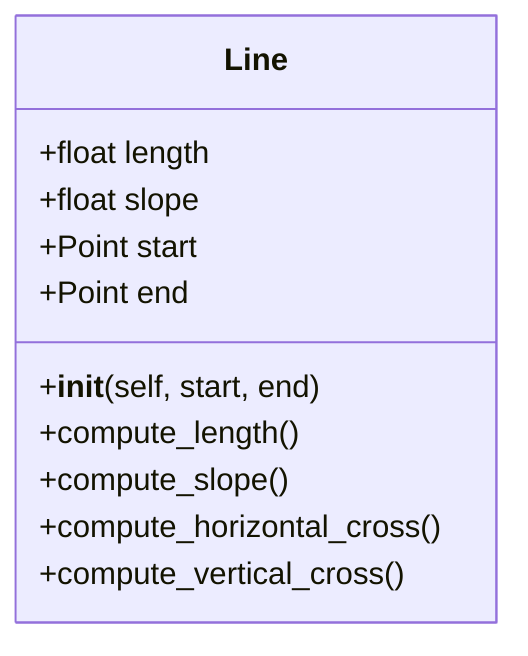
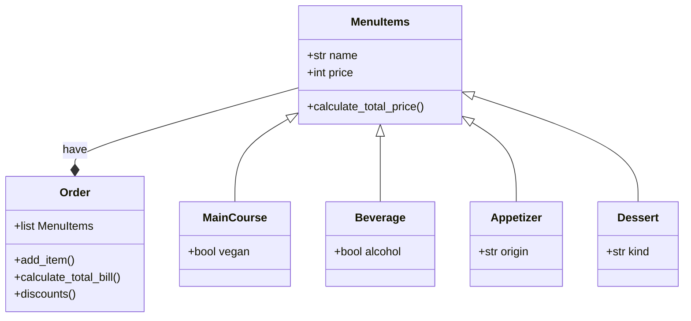

# Third_Challenge_OOP

## Create a repo with the class exercise


The class excersice was make a code that can recive datums by 4 diferent methods, and calculate his area, interference point, perimeter and another things of a rectangle or a square.

```python
import math


class Point:
  definition: str = "Entidad geometrica abstracta que representa una ubicación en un espacio."

  def __init__(self, x: float=0, y: float=0):
    self.x = x
    self.y = y

  def move(self, new_x: float, new_y: float):
    self.x = new_x
    self.y = new_y

  def reset(self):
    self.x = 0
    self.y = 0

  def compute_distance(self, point) -> float:
    return round(((self.x - point.x)**2 + (self.y - point.y)**2)**(0.5), 2)
    

class Line:
  definition: str = "It's a join between two points"
  def __init__(self, start_point: Point, end_point: Point):
      self.start_point = start_point
      self.end_point = end_point
      self.length = self.compute_length_line()
      self.slope = self.compute_slope()
      self.x_cross = self.compute_horizontal_cross()
      self.y_cross = self.compute_vertical_cross()

  def compute_length_line(self)-> float:
      if (self.end_point.x == self.start_point.x) and (self.end_point.y == self.start_point.y):
          return "The starting_point and the ending_point are the same, it's not a line so, it doesn't have length"
      else:
          return round((self.start_point.compute_distance(self.end_point)), 2)

  def compute_slope(self)-> float:
      if (self.end_point.x == self.start_point.x) and (self.end_point.y == self.start_point.y):
          return "The starting_point and the ending_point are the same, it's not a line so, it doesn't have slope"
      elif (self.end_point.x - self.start_point.x == 0) and (self.end_point.y != self.start_point.y):
          return 90.0
      elif (self.end_point.y - self.start_point.y == 0) and (self.end_point.x != self.start_point.x):
          return 0.0
      else:
        self.new_end_point = Point(x=self.end_point.x-self.start_point.x, y=self.end_point.y-self.start_point.y)

        if self.length == 0:
            return 0
        else:
            self.magic_formule = self.new_end_point.x/(self.length)
            if self.new_end_point.y < 0:
                return round(360 - math.degrees(math.acos(self.magic_formule)), 2)
            else:
                return round(math.degrees(math.acos(self.magic_formule)), 2)


  def compute_horizontal_cross(self)-> float:
      if 0 in range(self.end_point.y, self.start_point.y) or 0 in range (self.start_point.y, self.end_point.y):
          return "There does exist an intersection with the x-axis"
      else:
          return "There doesn't exist an intersection with the x-axis"

  def compute_vertical_cross(self)-> float:
      if 0 in range(self.end_point.x, self.start_point.x) or 0 in range (self.start_point.x, self.end_point.x):
          return "There does exist an intersection with the y-axis"
      else:
          return "There doesn't exist an intersection with the y-axis"

class Rectangle:
  
  def __init__(self, width: float=0, height:float=0, point: float=0) :
      self.width = width
      self.height = height
      self.point = point
      self.area = self.compute_area()
      self.perimeter = self.compute_perimeter()


  def compute_interference_point(self, interference_point)-> str:
      self.interference_point = interference_point

      if (self.interference_point.x in range(int(self.point.x - (self.width/2)), int(self.point.x + (self.width/2)))) and (self.interference_point.y in range(int(self.point.y - (self.height/2)), int(self.point.y + (self.height/2)))): 
          return "The point it's in the figure"
      else:
          
          return "The point it's not in the figure"

  
    
  def compute_area(self):
      area = self.width*self.height
      return area
    
  def compute_perimeter(self):
      perimeter = 2*(self.width + self.height)
      return perimeter


class Square(Rectangle):
    def __init__(self, side, point):
        super().__init__(side, side, point)


if __name__ == "__main__":
    
    print("Hello user, this code could calculate the area, perimeter, interference point, and interference \nline of a square or rectangle, depending on the method that you choose: ")
    print("Which figure would you like to use?")

    start = True
    figure: str = input("Write square or rectangle, depending on the figure that you want to work: ")
    
    print("\nMethod 1 will take the coordinates of the Bottom-left corner point, the width and height")
    print("Method 2 will take the coordinates of the center point, the width, and the height")
    print("Method 3 will take the coordinates of two opposite points")
    print("Method 4 will take the coordinates of four lines, because a rectangle is composed of four lines")

    method: int = int(input("Enter the method that you want to use: "))

    if method == 1:
          bottom_left_corner =  Point(x= int(input("Enter the coordinate in x of the bottom left corner: ")), y= int(input("Enter the coordinate in y of the bottom left corner: ")))
          rectangle_height:int = int(input("Enter the height of your figure: "))
          rectangle_width:int = int(input("Enter the width of your figure: "))
          centre = Point(x= bottom_left_corner.x + (rectangle_width/2), y= bottom_left_corner.y + (rectangle_height/2))
          fuction: bool = True

    elif method == 2:
          centre = Point(x= int(input("Enter the coordinate in x of the centre: ")), y= int(input("Enter the coordinate in y of the centre: ")))    
          rectangle_height:int = int(input("Enter the height of your figure: "))
          rectangle_width:int = int(input("Enter the width of your figure: "))
          fuction: bool = True

    elif method == 3:
          first_opposite_corner = Point(x= int(input("Enter the coordinate in x of the first opposite corner: ")), y= int(input("Enter the coordinate in y of the first opposite corner: ")))
          second_opposite_corner = Point(x= int(input("Enter the coordinate in x of the second opposite corner: ")), y= int(input("Enter the coordinate in y of the second opposite corner: ")))
          rectangle_width = abs(first_opposite_corner.x -second_opposite_corner.x)
          rectangle_height = abs(first_opposite_corner.y -second_opposite_corner.y)

          if first_opposite_corner.x < second_opposite_corner.x and first_opposite_corner.y < second_opposite_corner.y:
              centre = Point(x= first_opposite_corner.x + (rectangle_width/2), y= first_opposite_corner.y + (rectangle_height/2))

          elif first_opposite_corner.x < second_opposite_corner.x and first_opposite_corner.y > second_opposite_corner.y:
              centre = Point(x= first_opposite_corner.x + (rectangle_width/2), y= first_opposite_corner.y - (rectangle_height/2))

          elif first_opposite_corner.x > second_opposite_corner.x and first_opposite_corner.y > second_opposite_corner.y:
              centre = Point(x= first_opposite_corner.x - (rectangle_width/2), y= first_opposite_corner.y - (rectangle_height/2))

          elif first_opposite_corner.x > second_opposite_corner.x and first_opposite_corner.y < second_opposite_corner.y:
              centre = Point(x= first_opposite_corner.x - (rectangle_width/2), y= first_opposite_corner.y + (rectangle_height/2)) 


          fuction: bool = True

    elif method == 4:
        print("The vertices must coincide in 'y' or in the 'x' of the consecutive vertex.")
        first_corner = Point(x= int(input("Enter the coordinate in x of the first corner: ")), y= int(input("Enter the coordinate in y of the first corner: ")))
        second_corner = Point(x= int(input("Enter the coordinate in x of the second corner: ")), y= int(input("Enter the coordinate in y of the second corner: ")))
        third_corner = Point(x= int(input("Enter the coordinate in x of the third corner: ")),  y= int(input("Enter the coordinate in y of the third corner: ")))
        fourth_corner = Point(x= int(input("Enter the coordinate in x of the fourth corner: ")), y= int(input("Enter the coordinate in y of the fourth corner: ")))
        if first_corner.y == second_corner.y and second_corner.x == third_corner.x:

            print("The vertices are correctly aligned in height or length.") 

            first_line: Line = Line(start_point = first_corner, end_point = second_corner)
            second_line: Line = Line(start_point = second_corner, end_point = third_corner)
            third_line: Line = Line(start_point = third_corner, end_point = fourth_corner)
            fourth_line: Line = Line(start_point = fourth_corner, end_point = first_corner)
            rectangle_width = abs(first_corner.x - second_corner.x)
            rectangle_height = abs(first_corner.y - third_corner.y)
            centre = Point(x=(first_corner.x + second_corner.x) / 2, y=(first_corner.y + third_corner.y) / 2)
            fuction:bool = True

        elif first_corner.x == second_corner.x and second_corner.y == third_corner.y:

            print("The vertices are correctly aligned in height or length.") 
            first_line: Line = Line(start_point = first_corner, end_point = second_corner)
            second_line: Line = Line(start_point = second_corner, end_point = third_corner)
            third_line: Line = Line(start_point = third_corner, end_point = fourth_corner)
            fourth_line: Line = Line(start_point = fourth_corner, end_point = first_corner)
            rectangle_width = abs(first_corner.x - third_corner.x)
            rectangle_height = abs(first_corner.y - second_corner.y)
            centre = Point(x=(second_corner.x + third_corner.x) / 2, y=(first_corner.y + third_corner.y) / 2)
            fuction:bool = True
        else:
            print("The vertices are not correctly aligned in height or length.")

            fuction:bool = False
    else:
        fuction:bool = False
       

    if fuction == False:

        print("Invalid method") 

    else:
        if figure == "rectangle":
            figure = Rectangle(width=rectangle_width, height=rectangle_height, point=centre)
        
        else: 
            figure = Square(side=rectangle_height, point=centre)

        print("\nThe area of this figure is:", figure.area)
        print("\nThe perimeter of this figure is: ", figure.perimeter)

        print("\nLet`s check if a point is in our figure")
        interference__point = Point(x=int(input("Enter the coordinate in x of the point: ")), y=int(input("Enter the coordinate in y of the point: ")))
        print(figure.compute_interference_point(interference_point = interference__point))

```
### Also, we have to define the class line, and we had to create methods for calculate her slope, lenght, compute horizontal cross
compute vertical cross.




For compute the slope we use the dot product and some vectorial formules for calculing it. (Guide vide: https://www.youtube.com/watch?v=gRIimumXW2w credits to: Matemáticas profe Alex 
)


```python
import math


class Point:
  definition: str = "Entidad geometrica abstracta que representa una ubicación en un espacio."

  def __init__(self, x: float=0, y: float=0):
    self.x = x
    self.y = y

  def move(self, new_x: float, new_y: float):
    self.x = new_x
    self.y = new_y

  def reset(self):
    self.x = 0
    self.y = 0

  def compute_distance(self, point) -> float:
    return round(((self.x - point.x)**2 + (self.y - point.y)**2)**(0.5), 2)
    

class Line:
  definition: str = "It's a join between two points"
  def __init__(self, start_point: Point, end_point: Point):
      self.start_point = start_point
      self.end_point = end_point
      self.length = self.compute_length_line()
      self.slope = self.compute_slope()
      self.x_cross = self.compute_horizontal_cross()
      self.y_cross = self.compute_vertical_cross()

  def compute_length_line(self)-> float:
      if (self.end_point.x == self.start_point.x) and (self.end_point.y == self.start_point.y):
          return "The starting_point and the ending_point are the same, it's not a line so, it doesn't have length"
      else:
          return round((self.start_point.compute_distance(self.end_point)), 2)

  def compute_slope(self)-> float:
      if (self.end_point.x == self.start_point.x) and (self.end_point.y == self.start_point.y):
          return "The starting_point and the ending_point are the same, it's not a line so, it doesn't have slope"
      elif (self.end_point.x - self.start_point.x == 0) and (self.end_point.y != self.start_point.y):
          return 90.0
      elif (self.end_point.y - self.start_point.y == 0) and (self.end_point.x != self.start_point.x):
          return 0.0
      else:
        self.new_end_point = Point(x=self.end_point.x-self.start_point.x, y=self.end_point.y-self.start_point.y)

        if self.length == 0:
            return 0
        else:
            self.magic_formule = self.new_end_point.x/(self.length)
            if self.new_end_point.y < 0:
                return round(360 - math.degrees(math.acos(self.magic_formule)), 2)
            else:
                return round(math.degrees(math.acos(self.magic_formule)), 2)


  def compute_horizontal_cross(self)-> float:
      if 0 in range(self.end_point.y, self.start_point.y) or 0 in range (self.start_point.y, self.end_point.y):
          return "There does exist an intersection with the x-axis"
      else:
          return "There doesn't exist an intersection with the x-axis"

  def compute_vertical_cross(self)-> float:
      if 0 in range(self.end_point.x, self.start_point.x) or 0 in range (self.start_point.x, self.end_point.x):
          return "There does exist an intersection with the y-axis"
      else:
          return "There doesn't exist an intersection with the y-axis"


 Linea = Line(start_point=Point(x=int(input("Enter the coordinate in x1 of the point: ")), y=int(input("Enter the coordinate in y1 of the point: "))), end_point=Point(x=int(input("Enter the coordinate in x2 of the point: ")), y=int(input("Enter the coordinate in y2 of the point: "))))
    print(Linea.slope, Linea.length, Linea.x_cross, Linea.y_cross)
```

## Once we have the class line, we could define a rectangle or a square like a composition of lines

```python
elif method == 4:
        print("The vertices must coincide in 'y' or in the 'x' of the consecutive vertex.")
        first_corner = Point(x= int(input("Enter the coordinate in x of the first corner: ")), y= int(input("Enter the coordinate in y of the first corner: ")))
        second_corner = Point(x= int(input("Enter the coordinate in x of the second corner: ")), y= int(input("Enter the coordinate in y of the second corner: ")))
        third_corner = Point(x= int(input("Enter the coordinate in x of the third corner: ")),  y= int(input("Enter the coordinate in y of the third corner: ")))
        fourth_corner = Point(x= int(input("Enter the coordinate in x of the fourth corner: ")), y= int(input("Enter the coordinate in y of the fourth corner: ")))
        if first_corner.y == second_corner.y and second_corner.x == third_corner.x:

            print("The vertices are correctly aligned in height or length.") 

            first_line: Line = Line(start_point = first_corner, end_point = second_corner)
            second_line: Line = Line(start_point = second_corner, end_point = third_corner)
            third_line: Line = Line(start_point = third_corner, end_point = fourth_corner)
            fourth_line: Line = Line(start_point = fourth_corner, end_point = first_corner)
            rectangle_width = abs(first_corner.x - second_corner.x)
            rectangle_height = abs(first_corner.y - third_corner.y)
            centre = Point(x=(first_corner.x + second_corner.x) / 2, y=(first_corner.y + third_corner.y) / 2)
            fuction:bool = True

        elif first_corner.x == second_corner.x and second_corner.y == third_corner.y:

            print("The vertices are correctly aligned in height or length.") 
            first_line: Line = Line(start_point = first_corner, end_point = second_corner)
            second_line: Line = Line(start_point = second_corner, end_point = third_corner)
            third_line: Line = Line(start_point = third_corner, end_point = fourth_corner)
            fourth_line: Line = Line(start_point = fourth_corner, end_point = first_corner)
            rectangle_width = abs(first_corner.x - third_corner.x)
            rectangle_height = abs(first_corner.y - second_corner.y)
            centre = Point(x=(second_corner.x + third_corner.x) / 2, y=(first_corner.y + third_corner.y) / 2)
```


# Restaurant scenario
In this excercise we have to:

-Define a base class MenuItem: This class should have attributes like name, price, and a method to calculate the total price.                                           
-Create subclasses for different types of menu items: Inherit from MenuItem and define properties specific to each type (e.g., Beverage, Appetizer, MainCourse).                                  
-Define an Order class: This class should have a list of MenuItem objects and methods to add items, calculate the total bill amount, and potentially apply specific discounts based on the order composition.
```python
class MenuItem:
    def __init__(self, name: str, price: int):
        self.name = name
        self.price = price
        self.total_price = self.calculate_total_price()
        

    def calculate_total_price(self):
        return self.price


class Beverage(MenuItem):
    def __init__(self, name: str, price: int, alcohol: bool):
        super().__init__(name, price,)
        self.alcohol = alcohol
        


class Appetizer(MenuItem):
    def __init__(self, name: str, price: int,origin: str):
        super().__init__(name, price,)
        self.origin = origin
        


class MainCourse(MenuItem):
    def __init__(self, name: str, price: int, vegan: bool):
        super().__init__(name, price,)
        self.vegan = vegan
        


class Dessert(MenuItem):
    def __init__(self, name: str, price: int, kind: str):
        super().__init__(name, price,)
        self.kind = kind
        


class Order:
    def __init__(self, Menu_items:list):
        self.Menu_items = Menu_items


    def add_items(self, new_food:list):
        self.new_food = new_food
        for i in self.new_food:
            self.Menu_items.append(i)


        

    def calculate_total_bill(self):
        total_money = []
        for i in self.Menu_items:
            total_money.append(i.total_price)
        return sum(total_money)


    def calculate_discounts(self):
        self.total_discount = self.calculate_total_bill()
        if len(self.Menu_items) > 5:
            return (self.total_discount - self.total_discount*0.05)
        else:
            return (self.total_discount)


if __name__ == "__main__":
    

    lemonade = Beverage(name="Lemonade", price=2000, alcohol=False)
    beer = Beverage(name="Beer", price=3000, alcohol=False)
    water = Beverage(name="Water", price=1000, alcohol=False)


    empanada = Appetizer(name="Lemonade", price=1500, origin="Colombia")
    arepa = Appetizer(name="Lemonade", price=2200, origin="Venezuela")
    


    chinese_rise = MainCourse(name="Chinese rise", price=20000, vegan=False)
    hamburger = MainCourse(name="Hamburger", price=25000, vegan=False)
    vegan_hamburger = MainCourse(name="Vegan_hambuerger", price=30000, vegan=True)


    ice_cream = Dessert(name="orange ice cream", price=3000, kind="Ice Cream")
    candys = Dessert(name="sweet mind", price=500, kind="Candy")
    cake = Dessert(name="Banana Cake", price=4500, kind="Cake")

    print("Menu")
    print("lemonade, water, beer, empanada, arepa, chinese rise, hamburger, vegan hamburger, Banana Cake, sweet mind, orange ice cream")

    print("So, you want a cake, a empanada, a water and a hamburger")

    First_order: Order = Order([cake, empanada, water, hamburger])

    start = True
    new_food = []
    while start or mores_food:
        start = False
        more_food: str = input("Would you like more food, yes or no?\n" )
        if more_food == "yes":
            mores_food = True
            food = input("Which one?: ")
            match food:
                case "lemonade": 
                    wished_food = lemonade
                case "beer":
                    wished_food = beer
                case "water":
                    wished_food= water
                case "arepa": 
                    wished_food = arepa
                case "empanada":
                    wished_food = empanada
                case "chinise rise":
                    wished_food= chinese_rise
                case "hamburger": 
                    wished_food = hamburger
                case "vegan hamburger":
                    wished_food = vegan_hamburger
                case "orange ice cream":
                    wished_food= ice_cream
                case "Banana Cake":
                    wished_food = cake
                case "sweet mind":
                    wished_food= candys
            new_food.append(wished_food)
        else:
            mores_food = False
        

    First_order.add_items(new_food=new_food)
        
    print("Your bill without discount is: ",First_order.calculate_total_bill())
    print("your bill with discounts is: ", First_order.calculate_discounts())
```
### **Class Diagram for the restaurant excersice**

