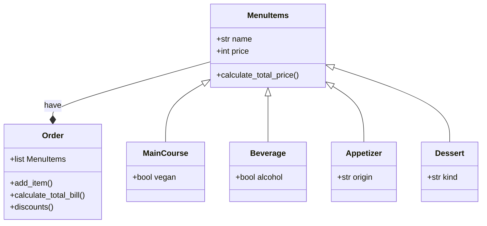

# Third_Challenge_OOP

**Class Diagram for the restaurant excersice**

```mermaid
classDiagram
    MenuItems  --* Order: have
    MenuItems <|-- MainCourse
    MenuItems <|-- Beverage
    MenuItems <|-- Appetizer
    MenuItems <|-- Dessert


    class MenuItems{
      +str name
      +int price
      +calculate_total_price()
    }

    class Beverage{
      +bool alcohol

    }

    class Appetizer{
        +str origin

    }

    class MainCourse{
        +bool vegan

    }
        class Dessert{
            +str kind

    }

    class Order{
      +list MenuItems
      +add_item()
      +calculate_total_bill()
      +discounts ()
    }
```
